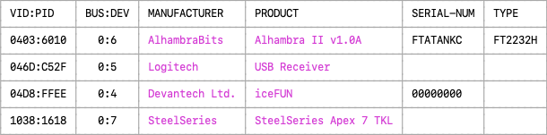
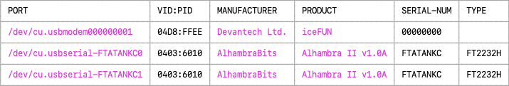

# Apio devices

The command group `apio devices` includes subcommands that lists devices
that are attached to the computer. It's main usage is diagnostics or
devices connectivity and drivers.

#### OPTIONS
```
-h, --help  Show this message and exit.
```

#### SUBCOMMANDS
```
apio devices usb
apio devices serial
```
<br>

-----

# Apio devices usb

The command `apio devices usb` displays the USB devices currently
connected to your computer. It is useful for diagnosing FPGA board
connectivity issues.

#### EXAMPLES
```
apio devices usb    # List the usb devices.
```

#### OPTIONS
```
-h, --help  Show this message and exit.
```
<br>

Example output



<br>

----

# Apio devices serial

The command `apio devices serial` displays the serial devices
currently connected to your computer. It is useful for diagnosing FPGA
board connectivity issues.

#### EXAMPLES
```
apio devices serial    # List the serial devices.
```

#### OPTIONS
```
-h, --help  Show this message and exit.
```

#### NOTES
  
* Devices such as FTDI FTDI2232 that have more than one
channel may be listed as multiple rows, one for each of their serial
ports.

* On Windows, manufacturer and product strings of FTDI based devices may
show their FTDI generic values rather than the custom values such such
as 'Alhambra II' set by the device manufacturer.

<br>

Example output



<br>

