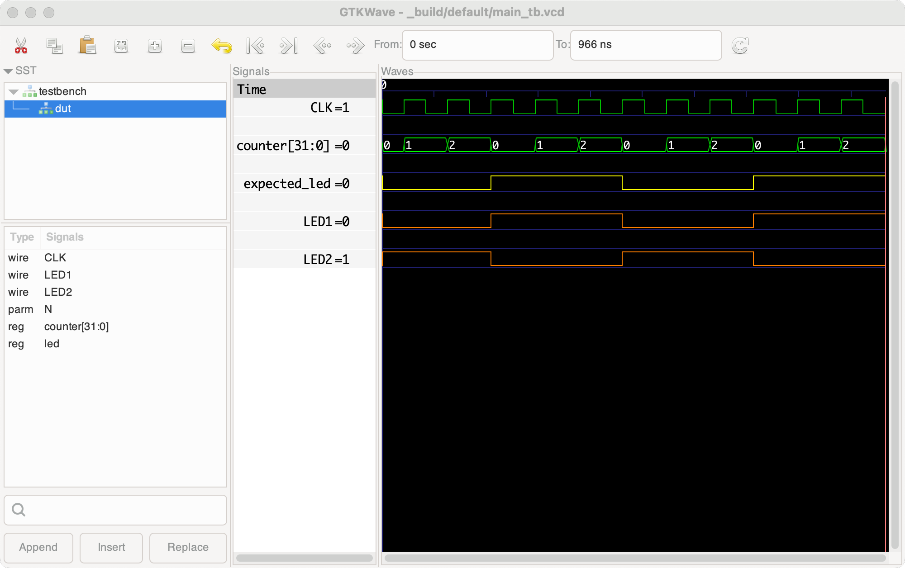

# Apio sim

  The command `apio sim` simulates the default or the specified
  testbench file and displays its simulation results in a graphical
  GTKWave window. The testbench is expected to have a name ending with
  `_tb`, such as `main_tb.v` or `main_tb.sv`. The default testbench file
  can be specified using the apio.ini option `default-testbench`. If
  `default-testbench` is not specified and the project has exactly one
  testbench file, that file will be used as the default testbench.

  #### EXAMPLES
```
apio sim                   # Simulate the default testbench.
apio sim my_module_tb.v    # Simulate the specified testbench.
apio sim my_module_tb.sv   # Simulate the specified testbench.
```

#### OPTIONS
```
-f, --force             Force simulation.
-e, --env name          Set the apio.ini env.
-p, --project-dir path  Set the root directory for the project.
-h, --help              Show this message and exit.
```

#### NOTES
* Do not use the Verilog `$dumpfile()` function in your testbenches, as this may override the default name and location Apio sets for the generated .vcd file.

* Testbench specification is always the testbench file path relative to the project directory, even if using the `--project-dir` option.

* The sim command defines the `INTERACTIVE_SIM` macro, which can be used in the testbench to distinguish between `apio test` and `apio sim`. For example, you can use this macro to ignore certain errors when running with `apio sim` and view the erroneous signals in GTKWave.

* For a sample testbench that utilizes this macro, see the apio example `alhambra-ii/getting-started`.

* When configuring the signals in GTKWave, save the configuration
  so you don’t need to repeat it each time you run the simulation.

<br>

Example sim results viewer:


<br>

